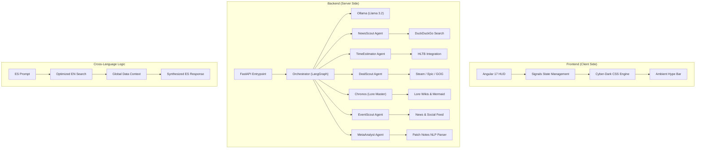

# 🎮 Gaming Nexus: Real-Time AI Assistant

[]()
[]()
[]()
[]()

> **Gaming Nexus** is an elite, AI-driven HUD designed to revolutionize how gamers interact with their favorite titles through real-time data orchestration and a stunning Cyber-Dark aesthetic.

---

## 🏗️ Architecture Deep Dive

The system utilizes an **Agentic Workflow** orchestrated via **LangGraph**. User queries are analyzed by an **Intent Orchestrator** that routes requests to specialized sub-agents, leveraging a **Cross-Language Retrieval (CLR)** strategy to maximize data quality.



---

## 🚀 Feature Showcase

| Module | Specialized Agent | Toolset | Feature Highlights |
| :--- | :--- | :--- | :--- |
| **📰 News Tracker** | `NewsScout` | DDG, News APIs | Multi-source aggregation, language badges, "original source" verification. |
| **⏱️ Time2Play** | `TimeEstimator` | HLTB, Search | Main Story/Completionist estimates, **Marathon Mode**, Backlog manager. |
| **💰 Price Hunter** | `DealScout` | Scrapers, DDG | Real-time comparison, **Neon Best-Deal Highlight**, 7-day Cache logic. |
| **📖 Lore Master** | `Chronos` | Wiki Parser | **Spoiler Shield (Blur)**, 3 Spoiler Levels, Mermaid-based character maps. |
| **🎉 Event Hub** | `EventScout` | Web Monitors | **Ambient Hype Bar**, real-time countdowns, leak confidence dashboard. |
| **📊 Patch Analyst** | `MetaAnalyst` | NLP Parser | **Buff vs Nerf Balance Sheet**, meta shift prediction, "Your Main" filter. |
| **💬 AI Chat Hub** | `Orchestrator` | LangGraph, Ollama | Context-aware routing, session history, artifact-rich visualization. |

---

## 🛠️ Tech Stack & Multilingual Logic

### Technical Foundation
- **Frontend**: **Angular 17** utilizing Standalone Components and **Signals** for reactive UI state.
- **Backend**: **FastAPI** (Python) for high-performance service delivery, integrated with **LangGraph** for complex agent task-management.
- **AI Model**: **Ollama** running **Llama 3.2** (3B) locally for low-latency, privacy-focused inference.

### 🌐 Cross-Language Retrieval (CLR)
We implemented a proprietary logic where the Orchestrator identifies the core "Gaming Intent" and translates technical queries (like "builds", "guides", or "stats") into **optimized English queries**. 
- **The Rationale**: English gaming databases (Wikis, Forums, Official Blogs) typically contain 10x more granular data.
- **The Result**: The agent fetches high-quality global data and re-synthesizes it using the LLM to present a unified response in Spanish.

---

## ⚙️ Installation & Setup

### 1. Prerequisites
- [Ollama](https://ollama.com/) (installed and active).
- Python 3.10+ & Node.js 18+.

### 2. Ollama Configuration
```bash
ollama pull llama3.2
```

### 3. Backend Setup
```bash
# From project root
cd server
python -m venv venv
# Activate (Windows: venv\Scripts\activate | Unix: source venv/bin/activate)
pip install -r requirements.txt
```

### 4. Frontend Setup
```bash
cd client
npm install
```

### 5. Environment Variables
Create a `.env` file in the `server` directory:
```env
OLLAMA_MODEL=llama3.2
OLLAMA_BASE_URL=http://localhost:11434
CORS_ORIGINS=http://localhost:4200
```

---

## 🎨 Estética & Design System: Cyber-Dark HUD

The interface is inspired by high-end gaming peripherals and tactical military HUDs.

- **Palette**: 
  - **Primary**: `Cyan (#00f3ff)` for data focus.
  - **Secondary**: `Purple (#bc13fe)` for lore and deep context.
  - **Alerts**: `Neon Green (#39ff14)` for best deals and buffs.
  - **Hype**: Dynamic brand colors (Nintendo Red, Xbox Green, PS Blue).
- **Glassmorphism**: 20px blur filters on all dashboard cards.
- **Vision Artifacts**: A side-panel rendering system that allows the AI to display complex charts, tables, or Mermaid diagrams without cluttering the chat history.

---

## 🧠 Reasoning Process: The Orchestrator

The `Orchestrator` agent act as the central nervous system. When a user sends a message:
1. **Intention Mapping**: It analyzes if the sentiment is informative (`news`), financial (`deals`), or strategic (`patch`).
2. **Dynamic Routing**: It delegates the task to the specialized agent (e.g., `MetaAnalyst` if the user asks "How does the latest patch affect my Main?").
3. **Synthesis**: It aggregates the output from the sub-agent and formats it specifically for the **Vision Artifact** panel if rich data is present.

---

> **Game Tip**: Use the **Event Hub** to stay ahead of the pack. The **Hype Bar** will pulse at the top of the app as soon as a major conference starts!

Developed with 🎮 by the **Gaming Nexus Team**.
