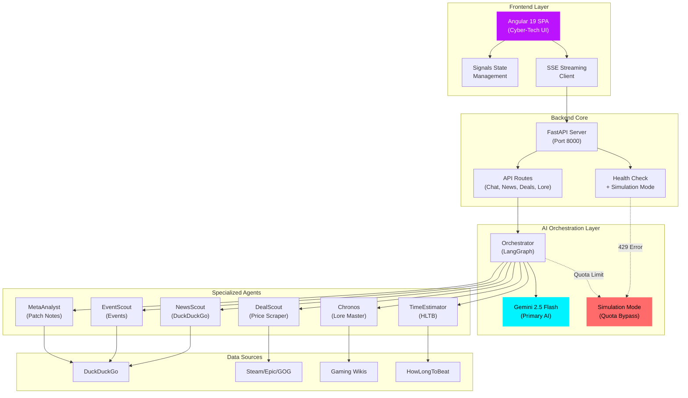

<div align="center">

# 🎮 GAMING NEXUS

### *Your Elite AI-Powered Gaming Intelligence Platform*

[](https://github.com/yourusername/ProyectoNexus)
[](https://fastapi.tiangolo.com/)
[](https://angular.io/)
[](https://ai.google.dev/)
[](LICENSE)

**Gaming Nexus** is a cutting-edge, AI-driven platform that transforms how gamers interact with their favorite titles through real-time lore exploration, price tracking, and intelligent agent-based orchestration.

[📖 Documentation](#-installation--setup) • [🚀 Quick Start](#-quick-start) • [🎯 Features](#-core-features) • [🛠️ Troubleshooting](#-troubleshooting)

---

</div>

## 🌟 What is Gaming Nexus?

Gaming Nexus is an **intelligent gaming assistant** powered by Google's **Gemini 2.5 Flash** AI model, designed to provide:

- **📖 Lore Exploration**: Deep dive into game stories, character backgrounds, and narrative timelines
- **💰 Price Tracking**: Real-time price monitoring across multiple gaming platforms
- **📰 News Aggregation**: Curated gaming news from trusted sources
- **🎯 Build Optimization**: Character builds and meta analysis for competitive games
- **⏱️ Time Estimation**: Game completion time tracking via HowLongToBeat integration
- **🎪 Event Monitoring**: Live tracking of gaming events, announcements, and conferences

All served through a **stunning Cyber-Tech interface** with real-time streaming responses and adaptive fallback mechanisms.

---

## 🏗️ System Architecture

Gaming Nexus employs a **microservices-inspired architecture** with specialized AI agents orchestrated through **LangGraph**, providing intelligent routing and response synthesis.



### Communication Flow

1. **Frontend** → Angular 19 with standalone components and Signals for reactive state
2. **HTTP/SSE** → Server-Sent Events for real-time streaming responses
3. **FastAPI Backend** → High-performance async Python server
4. **Orchestrator** → LangGraph-based intelligent request routing
5. **AI Engine** → Gemini 2.5 Flash (primary) with simulation fallback
6. **Specialized Agents** → Domain-specific tools for news, deals, lore, etc.

### Simulation Mode (Quota Bypass)

When the Gemini API returns a **429 (Resource Exhausted)** error:

```python
# Automatic fallback to simulation mode
if "429" in error or "RESOURCE_EXHAUSTED" in error:
    return SimulatedResponse(
        content="[🔄 MODO SIMULACIÓN] Pre-cached response...",
        mode="simulation"
    )
```

The system **automatically switches** to pre-configured responses to maintain functionality during quota limits.

---

## 🛠️ Tech Stack

<div align="center">

### **Frontend**


### **Backend**


### **AI & Services**


### **Tools & Libraries**


</div>

---

## 📦 Installation & Setup

### Prerequisites

Before starting, ensure you have:

- **Python 3.10+** ([Download](https://www.python.org/downloads/))
- **Node.js 18+** ([Download](https://nodejs.org/))
- **Git** ([Download](https://git-scm.com/))
- **Google Gemini API Key** ([Get yours](https://makersuite.google.com/app/apikey))

### Quick Start

#### 1️⃣ Clone the Repository

```bash
git clone https://github.com/yourusername/ProyectoNexus.git
cd ProyectoNexus
```

#### 2️⃣ Backend Setup

```bash
# Navigate to server directory
cd server

# Create virtual environment
python -m venv venv

# Activate virtual environment
# Windows:
venv\Scripts\activate
# Linux/Mac:
source venv/bin/activate

# Install dependencies
pip install -r requirements.txt

# Create .env file
copy .env.example .env  # Windows
cp .env.example .env    # Linux/Mac
```

**Edit `.env` and add your Gemini API key:**

```env
GEMINI_API_KEY=your_actual_api_key_here
GEMINI_MODEL=models/gemini-2.5-flash
CORS_ORIGINS=http://localhost:4200
```

#### 3️⃣ Frontend Setup

```bash
# Navigate to client directory
cd ../client

# Install dependencies
npm install
```

#### 4️⃣ Launch the Application

**Option A: Automated Script (Windows)**

```bash
cd ..
start.bat
```

**Option B: Manual Launch**

```bash
# Terminal 1 - Backend
cd server
venv\Scripts\activate
uvicorn main:app --reload --host 0.0.0.0 --port 8000

# Terminal 2 - Frontend
cd client
ng serve -o
```

#### 5️⃣ Access the Application

- **Frontend**: [http://localhost:4200](http://localhost:4200)
- **Backend API**: [http://localhost:8000](http://localhost:8000)
- **API Docs**: [http://localhost:8000/docs](http://localhost:8000/docs)

---

## 🎯 Core Features

| Feature | Agent | Description | Status |
|---------|-------|-------------|--------|
| **AI Chat** | Orchestrator | Real-time streaming chat with Gemini AI | ✅ **Active** |
| **News Feed** | NewsScout | Curated gaming news from multiple sources | ✅ **Active** |
| **Lore Database** | Chronos | Deep lore exploration with spoiler protection | 🚧 **Beta** |
| **Price Tracker** | DealScout | Multi-platform price comparison | 🚧 **Beta** |
| **Time Estimates** | TimeEstimator | Game completion time via HLTB | ✅ **Active** |
| **Event Hub** | EventScout | Live event tracking and notifications | 🚧 **Beta** |
| **Meta Analysis** | MetaAnalyst | Patch notes and meta shift predictions | 🚧 **Beta** |

### Feature Highlights

#### 🤖 **Intelligent Agent Routing**

The Orchestrator analyzes user intent and routes queries to specialized agents:

```python
# Example: User asks "¿Cuánto tarda en completarse Elden Ring?"
Orchestrator → TimeEstimator → HLTB → Response: "98 horas (Main+Extras)"
```

#### 🌐 **Cross-Language Retrieval (CLR)**

Queries are optimized for English databases (higher data quality) and synthesized back to Spanish:

```
User Input (ES): "Mejores builds para Jinx en LoL"
    ↓
Internal Query (EN): "Best Jinx builds League of Legends patch 14.3"
    ↓
Data Retrieval → English wikis, forums, patch notes
    ↓
AI Synthesis (ES): Detailed Spanish response with optimized builds
```

#### 📊 **Artifact System**

Complex data is rendered in a dedicated sidebar panel with:
- **Tables**: Character stats, price comparisons
- **Diagrams**: Mermaid-based skill trees, character relationships
- **Charts**: Meta trends, buff/nerf analysis

---

## 🛠️ Troubleshooting

### ❌ Problem: `429 Resource Exhausted` Error

**Symptom**: Chat returns error or switches to simulation mode

**Cause**: Gemini API daily quota exceeded

**Solutions**:

1. **Wait for Quota Reset** (Resets at midnight PST)
   
2. **Use Simulation Mode** (Automatic fallback)
   ```
   System automatically serves pre-cached responses
   Header shows: "🔄 MODO SIMULACIÓN"
   ```

3. **Upgrade API Tier**
   - Visit [Google AI Studio](https://makersuite.google.com/)
   - Upgrade to paid tier for higher limits

4. **Check Health Endpoint**
   ```bash
   curl http://localhost:8000/api/health
   ```
   Response:
   ```json
   {
     "status": "healthy",
     "mode": "simulation",  // or "online"
     "model": "gemini-2.5-flash"
   }
   ```

### ❌ Problem: Backend Won't Start

**Symptom**: `ModuleNotFoundError` or import errors

**Solution**:

```bash
# Ensure virtual environment is activated
cd server
venv\Scripts\activate  # Windows
source venv/bin/activate  # Linux/Mac

# Reinstall dependencies
pip install --upgrade -r requirements.txt

# Verify installation
python -c "import fastapi; print('FastAPI OK')"
python -c "from google.genai import Client; print('Gemini SDK OK')"
```

### ❌ Problem: Frontend Build Errors

**Symptom**: `npm ERR!` or TypeScript errors

**Solution**:

```bash
cd client

# Clear cache and reinstall
rm -rf node_modules package-lock.json
npm cache clean --force
npm install

# Verify Angular CLI
ng version
```

### ❌ Problem: CORS Errors

**Symptom**: Browser console shows CORS policy errors

**Solution**:

Edit `server/main.py`:

```python
app.add_middleware(
    CORSMiddleware,
    allow_origins=["http://localhost:4200"],  # Add your domain
    allow_credentials=True,
    allow_methods=["*"],
    allow_headers=["*"],
)
```

### ❌ Problem: Connection Status Shows "OFFLINE"

**Symptom**: Header shows red "OFFLINE" indicator

**Causes & Solutions**:

1. **Backend not running**
   ```bash
   cd server
   uvicorn main:app --reload
   ```

2. **Wrong port configuration**
   - Verify backend runs on port **8000**
   - Check `environment.ts`: `apiUrl: 'http://localhost:8000'`

3. **Health endpoint not responding**
   ```bash
   curl http://localhost:8000/api/health
   ```

---

## 🗺️ Project Roadmap

### ✅ **Phase 1: Foundation (Completed)**

- [x] FastAPI backend with SSE streaming
- [x] Angular 19 frontend with Cyber-Tech UI
- [x] Gemini 2.5 Flash integration
- [x] Orchestrator + 6 specialized agents
- [x] Health monitoring + simulation fallback
- [x] Responsive mobile layout

### 🚧 **Phase 2: Enhancement (Current)**

- [x] Connection status indicator
- [x] Chat interface with message bubbles
- [x] Global Cyber-Tech design system
- [ ] Persistent lore database (SQLite)
- [ ] Price tracking historical charts
- [ ] Event countdown timers

### 🔮 **Phase 3: Advanced Features (Planned)**

- [ ] User authentication & profiles
- [ ] Favorite games tracking
- [ ] Push notifications for events
- [ ] Social sharing integration
- [ ] Mobile app (React Native)
- [ ] Voice commands (Speech API)

---

## 📁 Project Structure

```
ProyectoNexus/
├── client/                          # Angular Frontend
│   ├── src/
│   │   ├── app/
│   │   │   ├── components/          # UI Components
│   │   │   │   ├── chat-stream/     # Chat interface
│   │   │   │   ├── sidebar/         # Navigation
│   │   │   │   └── hype-bar/        # Event notifications
│   │   │   ├── services/
│   │   │   │   └── nexus.service.ts # API client + SSE
│   │   │   └── app.component.*      # Main layout
│   │   └── styles.scss              # Global Cyber-Tech theme
│   └── package.json                 # Node dependencies
│
├── server/                           # FastAPI Backend
│   ├── agents/                       # AI Agents
│   │   ├── orchestrator.py          # Main routing logic
│   │   ├── news_scout.py            # News aggregation
│   │   ├── deal_scout.py            # Price tracking
│   │   ├── chronos.py               # Lore master
│   │   ├── time_estimator.py        # HLTB integration
│   │   ├── event_scout.py           # Event monitoring
│   │   └── meta_analyst.py          # Patch analysis
│   ├── routes/                       # API Endpoints
│   │   ├── health.py                # Health check
│   │   ├── chat.py                  # Chat streaming
│   │   ├── news.py                  # News API
│   │   ├── deals.py                 # Deals API
│   │   └── lore.py                  # Lore API
│   ├── services/
│   │   └── llm_service.py           # Gemini service
│   ├── main.py                       # FastAPI entry point
│   ├── llm_config.py                # AI configuration
│   └── requirements.txt             # Python dependencies
│
├── start.bat                         # Windows launcher
├── setup_nexus.bat                   # Windows installer
└── README.md                         # This file
```

---

## 🎨 Design Philosophy

Gaming Nexus employs a **Cyber-Tech aesthetic** inspired by:

- **Military HUDs**: Data-dense displays with clear information hierarchy
- **Gaming Peripherals**: Razer/Corsair RGB aesthetics
- **Cyberpunk Genre**: Neon accents, dark backgrounds, futuristic fonts

### Color Palette

| Color | Usage | Hex |
|-------|-------|-----|
| **Cyan** | Primary accent, data focus | `#00f3ff` |
| **Magenta** | Secondary accent, lore content | `#bc13fe` |
| **Neon Green** | Success states, best deals | `#39ff14` |
| **Deep Black** | Background, panels | `#0a0a0c` |
| **Pure White** | Primary text | `#ffffff` |

### Typography

- **Display**: [Orbitron](https://fonts.google.com/specimen/Orbitron) (Headings)
- **Monospace**: [JetBrains Mono](https://www.jetbrains.com/lp/mono/) (Code, stats)
- **Body**: System UI fonts (optimal readability)

---

## 🤝 Contributing

We welcome contributions! Please follow these guidelines:

1. **Fork the repository**
2. **Create a feature branch** (`git checkout -b feature/AmazingFeature`)
3. **Commit your changes** (`git commit -m 'Add AmazingFeature'`)
4. **Push to the branch** (`git push origin feature/AmazingFeature`)
5. **Open a Pull Request**

### Code Standards

- **Python**: Follow PEP 8
- **TypeScript**: Use Angular style guide
- **Commits**: Use conventional commits format

---

## 📜 License

This project is licensed under the **MIT License** - see the [LICENSE](LICENSE) file for details.

---

## 🙏 Acknowledgments

- **Google Gemini Team** for the incredible AI model
- **FastAPI** for the blazing-fast Python framework
- **Angular Team** for the robust frontend framework
- **Gaming Community** for inspiration and feedback

---

<div align="center">

**Built with 🎮 by the Gaming Nexus Team**

[⬆ Back to Top](#-gaming-nexus)

</div>
