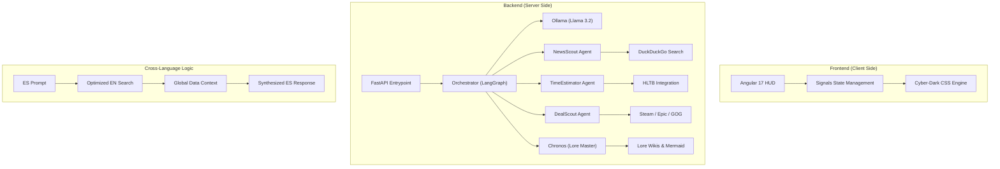

# 🎮 Gaming Nexus: Real-Time AI Assistant

[]()
[]()
[]()
[]()

> **Gaming Nexus** is a state-of-the-art AI-powered HUD for gamers. It orchestrates specialized agents to deliver news, play-time estimates, price comparisons, and deep lore insights through a stunning Cyber-Dark aesthetic.

---

## 🏗️ Architecture Deep Dive

The system utilizes an **Agentic Workflow** orchestrated via **LangGraph**. User queries are analyzed by an Intent Orchestrator that routes requests to specialized sub-agents, leveraging a **Cross-Language Retrieval (CLR)** strategy to maximize data quality.



---

## 🚀 Feature Showcase

| Tab | Specialized Agent | Toolset | Feature Highlights |
| :--- | :--- | :--- | :--- |
| **📰 News Tracker** | `NewsScout` | DuckDuckGo, NLP | Multi-source aggregation, language badges, "See Original" link. |
| **⏱️ Time2Play** | `TimeEstimator` | HLTB, Search | Main Story/Completionist estimates, Backlog Manager, Marathon Mode. |
| **💰 Price Hunter** | `DealScout` | Scrapers, DDG | Real-time comparison, **Neon Best-Deal Highlight**, 7-day Cache. |
| **📖 Lore Master** | `Chronos` | Wiki Parser | **Spoiler Shield (Blur)**, 3 Spoiler Levels, Mermaid Character Maps. |
| **💬 AI Chat Hub** | `Orchestrator` | LangGraph, Ollama | Context-aware routing, session history, artifact visualization. |

---

## 🛠️ Tech Stack & Multilingual Logic

### Technical Foundation
- **Frontend**: **Angular 17** with Standalone Components and **Signals** for reactive UI.
- **Backend**: **FastAPI** high-performance Python framework with SSE (Server-Sent Events) for streaming.
- **Orchestration**: **LangGraph** for stateful multi-agent workflows.
- **AI Model**: **Ollama** running **Llama 3.2** locally.

### 🌐 Cross-Language Retrieval (CLR)
We implemented a proprietary logic where the Orchestrator translates technical intents (like "builds", "guides", or "stats") into **English queries** regardless of the user's input language.
- **Reason**: English gaming wikis contain 10x more granular data.
- **Result**: The agent fetches high-quality global data, synthesizes it using the LLM, and presents the final insight in the user's native language.

---

## ⚙️ Installation & Setup

### 1. Prerequisites
- [Ollama](https://ollama.com/) installed and running.
- Python 3.10+ and Node.js 18+.

### 2. Ollama Configuration
```bash
ollama pull llama3.2
```

### 3. Backend Setup
```bash
cd server
python -m venv venv
source venv/bin/activate # or venv\Scripts\activate on Windows
pip install -r requirements.txt
```

### 4. Frontend Setup
```bash
cd client
npm install
```

### 5. Environment Variables
Create a `.env` file in the `server` directory:
```env
OLLAMA_MODEL=llama3.2
OLLAMA_BASE_URL=http://localhost:11434
CORS_ORIGINS=http://localhost:4200
```

---

## 🎨 Estética & Design System: Cyber-Dark HUD

The visual language of Gaming Nexus is inspired by **high-tech military HUDs** and **Cyberpunk aesthetics**.

- **Palette**: 
  - Primary: `Cyan (#00f3ff)` for data and focus.
  - Secondary: `Purple (#bc13fe)` for lore and mysticism.
  - Success: `Neon Green (#39ff14)` for the best game deals.
  - UI: `Gold (#ffcc00)` for search and premium features.
- **Components**: Glassmorphism with 20px blur, background scanlines, and authentic CRT noise overlay.
- **Vision Artifacts**: A side-panel system that renders rich visual data (graphs, tables, code) without breaking the chat flow.

---

---

## 🔍 Module Deep Dives

### ⏱️ Time2Play (HowLongToBeat)
Integrated system for game completion estimates and backlog management.
- **Marathon Mode**: Calculate days to finish based on your daily playtime (e.g., "2.5h/day → 56 days").
- **Backlog Manager**: Aggregate total completion time for multiple titles.
- **Worth Badges**: Dynamic valuation (💎 Excellent, 👍 Good, 👌 Fair, 💸 Expensive) based on price-to-hour ratio.
- **API Endpoints**:
  - `POST /api/hltb/game` - Single game stats.
  - `POST /api/hltb/backlog` - Batch calculation.
  - `POST /api/hltb/marathon` - Playtime planning.

### 💰 Price Hunter (DealScout)
Real-time web monitoring of game prices across popular storefronts.
- **Multi-Store Search**: Steam, Epic, GOG, and Instant Gaming.
- **Best-Deal Detection**: Automatically identifies the lowest price with neon green visual highlighting.
- **Currency Intelligence**: Standardized pricing for accurate comparison.
- **API Endpoints**:
  - `POST /api/deals/search` - Global store search.
  - `POST /api/deals/compare` - Target store comparison.

### 📖 Lore Master (Chronos)
Contextual story retrieval with intelligent spoiler protection.
- **Spoiler Shield**: 3 levels of protection (`none`, `light`, `full`) with manual reveal (Blur filter).
- **Character Mapping**: Generates **Mermaid.js** diagrams of character relationships.
- **Source Citations**: Links to the original lore wikis and community databases.
- **API Endpoints**:
  - `POST /api/lore/story` - Narrative summary retrieval.
  - `POST /api/lore/characters` - Relationship extraction.

---

## 🧠 Reasoning Process: The Orchestrator

The `Orchestrator` agent acts as the brain of the nexus. When a message is received:
1. **Intention Mapping**: Categorizes the prompt into `news`, `time`, `deals`, or `lore`.
2. **Tool Selection**: Based on the category, it delegates searching and scraping to the specialized agent.
3. **State Management**: Uses LangGraph to keep track of the conversation context, ensuring that "Elden Ring" in the first query remains the context for "how long to beat it?" in the second.

---

> **Tip**: Use the **Spoiler Shield** in Lore Master to explore safely. Set your level to `none` if you just want the premise, or `full` if you've already beaten the game!

Developed with 🎮 by the Gaming Nexus Team.
