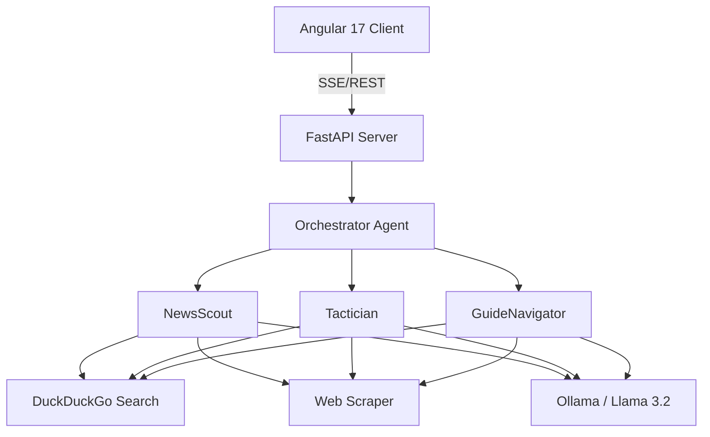

# 🎮 Gaming Nexus: Real-Time AI Assistant


-blue)

**Gaming Nexus** es un sistema de vanguardia diseñado para el jugador moderno. Utiliza agentes de IA orquestados con **LangGraph** para extraer información crucial (builds, parches, guías, noticias) directamente de la web en tiempo real, eliminando la dependencia de bases de conocimiento estáticas.

---

## ✨ Características Principales

### 🔴 Transmisiones en Vivo (News)
Sección de noticias de última hora que escanea la web en busca de anuncios importantes, notas de parches y eventos de E-Sports.
-   **Categorías**: General, Patches, Releases, E-Sports.
-   **IA Activa**: El `NewsScoutAgent` sintetiza múltiples fuentes para ofrecer resúmenes ejecutivos.

### 📅 Calendario de Lanzamientos
Visualización interactiva de los próximos grandes lanzamientos de la industria.
-   **Timeline**: Vista cronológica de juegos esperados.
-   **Sincronización**: Datos frescos obtenidos mediante scraping en tiempo real.

### 💬 Asistente IA Avanzado (Chat)
Interface de chat con **Streaming SSE** que permite ver el proceso de razonamiento del agente.
-   **Tactician**: Especialista en builds y meta de cualquier juego competitivo.
-   **GuideNavigator**: Guías detalladas paso a paso para misiones y jefes.
-   **Vision Artifacts**: Los agentes generan cuadros técnicos y paneles laterales para info detallada.

### ✉️ Newsletter (Próximamente)
Suscríbete para recibir un resumen diario de lo más importante en tu correo cada mañana a las 8:00 AM.

---

## 🛠️ Arquitectura del Sistema



### Tecnologías
-   **Frontend**: Angular 17+ (Signals, Standalone Components, CSS Variables).
-   **Backend**: Python, FastAPI, LangGraph, sse-starlette.
-   **Búsqueda**: Crawling en tiempo real con filtrado de spam y contenido no-gaming.
-   **LLM**: Ollama (Local) para privacidad y velocidad.

---

## 🚀 Instalación y Configuración

### Requisitos Previos
-   **Python 3.11+**
-   **Node.js 18+**
-   **Ollama** (Servicio activo)

### 1. Preparar el Backend
```bash
cd server
python -m venv venv
source venv/bin/activate  # venv\Scripts\activate en Windows
pip install -r requirements.txt
```

#### Variables de Entorno (.env)
Crea un archivo `.env` en `server/`:
```env
OLLAMA_MODEL=llama3.2
OLLAMA_BASE_URL=http://localhost:11434
CORS_ORIGINS=http://localhost:4200
EMAIL_PASSWORD=qrkk_spee_jyhu_pqnm  # Nexus App Password
```

### 2. Preparar el Frontend
```bash
cd client
npm install
```

---

## 🏃 Cómo Ejecutar

1.  **Ollama**: `ollama run llama3.2`
2.  **Backend**: `cd server && python main.py` (Puerto 8000)
3.  **Frontend**: `cd client && npm start` (Puerto 4200)

---

## 📊 API Referencia

| Método | Endpoint | Descripción |
| :--- | :--- | :--- |
| `POST` | `/api/chat/stream` | Comunicación bilateral con streaming de agentes |
| `POST` | `/api/news` | Obtiene noticias por categoría (NewsScout) |
| `GET` | `/api/calendar` | Listado de juegos próximos (Game Scout) |
| `GET` | `/api/chat/history/{id}` | Recupera la memoria de una sesión |
| `POST` | `/api/newsletter/subscribe`| Registro para noticias diarias |

---

## 🎨 Diseño: Cyber-Dark Mode
El proyecto utiliza una estética **Neon/Cyberpunk** definida en `styles.scss`:
-   **Primary (Cyan)**: `#00f3ff` (Interactividad)
-   **Background**: `#050505` (Inmersión)
-   **Scanlines**: Efecto de rejilla retro-futurista integrado en el layout.
-   **Glow**: Efectos de luminiscencia en botones y tarjetas.

---

Desarrollado con ❤️ para la comunidad gaming.
